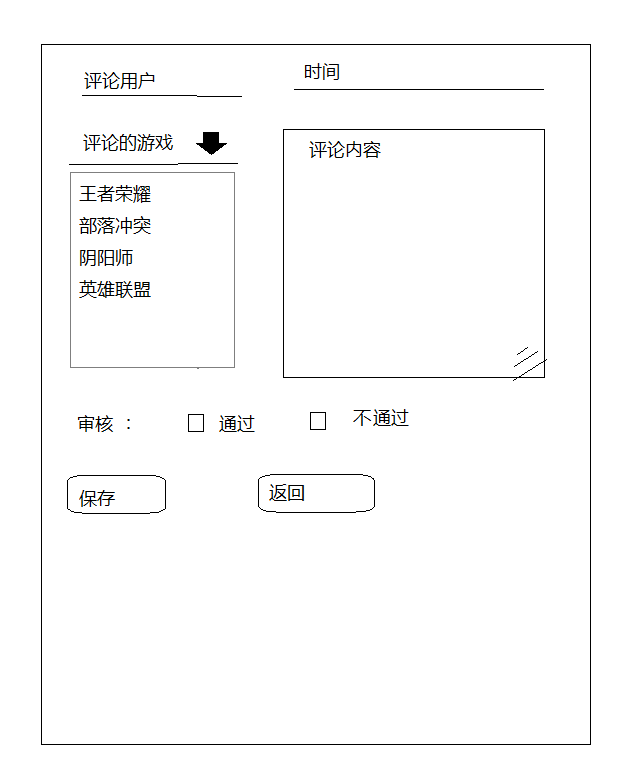
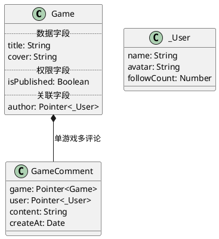

# 《制作一个针对Pointer字段的编辑组件》
# 一、功能需求：分析与描述

## 应用场景
### 问题描述

游戏项目的后台管理端，在制作评论编辑页面的时候，发现有一个指针Pointer字段，是Object类型，无法用HTML基础的input组件完成该字段的编辑功能。

且该功能在后台管理中十分常见，因此需要定制一个专用且通用的组件。

示意图：
- 示意图 Contributor @xuelianli

### 功能需求
当用户点击编辑，在该字段位置，需要提供一个包含搜索功能与选择功能的综合功能区域。

- 例如：游戏评论的所属游戏字段 comment.game
    - 用户点击输入框，输入游戏名字
    - 侧面列表中显示搜索到的游戏卡片，右侧有一个选择按钮
    - 用户选择对应的游戏卡片，作为该评论的所属游戏字段实际的内容
    - 用户点击保存，将其选择的游戏字段数值，拼接成后端接口所需的Pointer格式
    - 正常保存，下次进入便捷页面，默认加载该游戏在该字段。
    - <span style="color:red">注意：以上过程描述，可作为组件的端对端测试用例</span>

## 技术相关

- 后端服务：[Parse Platform](https://docs.parseplatform.org/rest/guide/)
- 前端组件：[Angular Component](https://angular.cn/guide/component-overview)

# 二、技术标准：逻辑与关系
## 2.1 后端服务：梳理数据格式
### 创建两个基本的数据范式
- Game 游戏类
- GameComment 游戏评论类
- _User 用户类

数据类图如下：


- 参考文档：[UML:技术文档编写规范](/docs/uml/document.md)

### 模拟请求创建一条评论

#### 评论的数据有哪些？
- 游戏id：pvhDehymnh
- 用户id：un5rXnf74X
- content:非非欧欧

#### 创建评论请求方法
- URL: http://metapunk.cn:9999/parse/classes/GameComment
- Method: POST
- Path: /parse/classes/GameComment
- Body: <json>

#### 错误尝试
``` json
{
    "game":"pvhDehymnh",
    "user":"un5rXnf74X",
    "content":"非非欧欧"
}
```

#### 错误的结果反馈
``` json
{
    "code": 111,
    "error": "schema mismatch for GameComment.game; expected Pointer<Game> but got String"
}
```

#### 问题思考
- JS中没有Pointer类型，该类型是这个后端接口服务自己定义的
    - 因此，我们应该查询接口文档找到Pointer具体格式：https://docs.parseplatform.org/rest/guide/
- 指针类型的完整格式：
``` js
// 官方格式 对Pointer指针的描写
// __type Pointer 这个数据对象是指针
// className Player 指向了Player表
// objectId XXXXX 指向了ID为XXXXX的数据对象
{"__type":"Pointer","className":"Player","objectId":"Vx4nudeWn"}

// 重新拼写
{
    "game":{"__type":"Pointer","className":"Game","objectId":"pvhDehymnh"}, 
    "user":{"__type":"Pointer","className":"_User","objectId":"un5rXnf74X"}, 
    "content":"非非欧欧"
}

// 成功创建
{
    "objectId": "7WTEIcul6A",
    "createdAt": "2023-01-10T06:54:38.590Z"
}
```

## 准备：游戏评论编辑相关页面
- 参考：[Project:创建一个用于管理端的子项目](/docs/cicd/project.md)
    - 目录：/projects/admin-gametap/src/modules/gameadmin/
    - 三个组件：
        - commentedit
        - commentlist
        - commentitem

``` sh
cd projects/admin-gametap/src/modules/gameadmin
ng g component commentedit --module=gameadmin
ng g component commentlist --module=gameadmin
ng g component commentitem --module=gameadmin

# 具体的编写过程，参考以前的学习文档
```

# 前端组件：指针编辑组件

- 组件名称：nova-edit-pointer

``` html
<!-- 使用方法 -->
<!-- value @Input Pointer<> 双向绑定要编辑的指针字段 -->
<!-- className @Input string 指针指向的类名Schema -->
<!-- searchCol @Input string 对应的名称搜索字段 -->
<nova-edit-pointer 
[(value)]="value" 
[className]="'Game'"
[searchCol]="'name'"
></nova-edit-pointer>
```

## 设计：指针编辑组件的技术实现

- 页面展示 DOM结构
    - 输入框 input#pointer
    - 列表 ul
        - 数据名称 span
        - 选择按钮 button#pick
- 数据逻辑 参数及方法
    - 参数
        - 
    - 方法
        - input#pointer
            - (keyup) => 根据用户输入搜索数据列表
        - button#pick
            - (clik) => 选择该数据

## 实现过程
- [edit-pointer/edit-pointer.component.ts](/projects/admin-gametap/src/modules/gameadmin/edit-pointer/edit-pointer.component.ts)
- [edit-pointer/edit-pointer.component.html](/projects/admin-gametap/src/modules/gameadmin/edit-pointer/edit-pointer.component.html)
``` sh
cd projects/admin-gametap/src/modules/gameadmin
ng g component edit-pointer --module=gameadmin
```