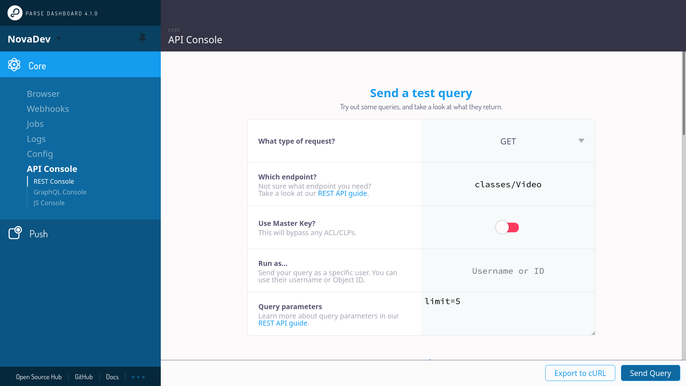
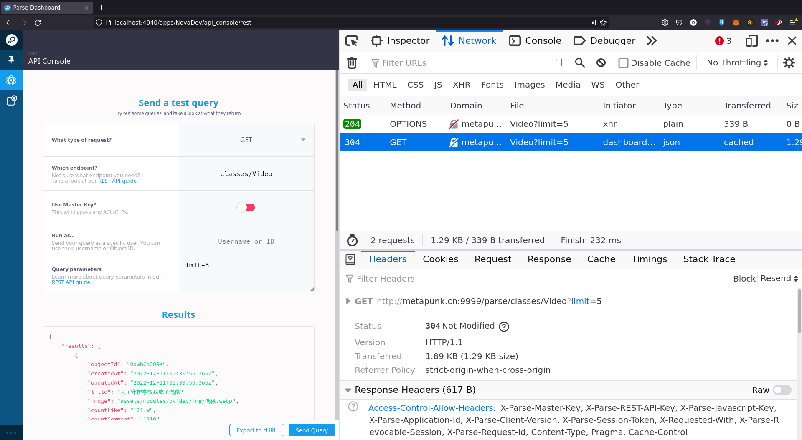

# 微服务环境搭建及测试


# 启动微服务看板
``` sh
# 全局安装Parse看板
npm i -g parse-dashboard

# 启动测试环境的Parse看板
parse-dashboard --appId dev --masterKey devmk --serverURL http://xxx.cn:9999/parse --appName NovaDev

#=>The dashboard is now available at http://0.0.0.0:4040/

```

# RESTful APIs 接口文档
- 用户接口：https://docs.parseplatform.org/rest/guide/#users
- 对象接口（CRUD）：https://docs.parseplatform.org/rest/guide/#objects
- 查询接口：https://docs.parseplatform.org/rest/guide/#queries

``` sh
# 数据查询接口,VideoWork为查询Schema表名
https://YOUR.PARSE-SERVER.HERE/parse/classes/VideoWork

# 常用查询参数 ?key=value
# order 排列
order=score,-name # 根据分数正序排列，再根据名称倒序排列
# limit skip 限制与跳过
limit=200 # 获取200条
skip=400 # 跳过前400条
# keys 指定表头字段
keys=score,playerName # 仅获取字段：playerName球员名称、score分数
```

# HTTP接口测试

- 启动看板，进入左下角ApiConsole界面


- 看板页面打开调试F12，进入Network标签
    - 点击看板Send发送请求
    - 右键Network中成功的请求，复制为fetch观察具体的请求体
        - 请求地址：URL
        - 请求头：Header
        - 请求参数：?xxx=xxx


- 复制出来的以下fetch请求，可以应用在服务数据获取函数中
- 参考服务HTTP请求说明文档：[HTTP网络请求基础与示例](/docs/backend/request.md)

``` js
await fetch("http://metapunk.cn:9999/parse/classes/Video?limit=5", {
    "credentials": "omit",
    "headers": {
        "User-Agent": "Mozilla/5.0 (X11; Linux x86_64; rv:91.0) Gecko/20100101 Firefox/91.0",
        "Accept": "*/*",
        "Accept-Language": "en-US,en;q=0.5",
        "X-Parse-Application-Id": "dev",
        "If-None-Match": "W/\"529-3kdywFCZKtQV4OQHHqeqnD8Jpb0\""
    },
    "referrer": "http://localhost:4040/",
    "method": "GET",
    "mode": "cors"
});

```