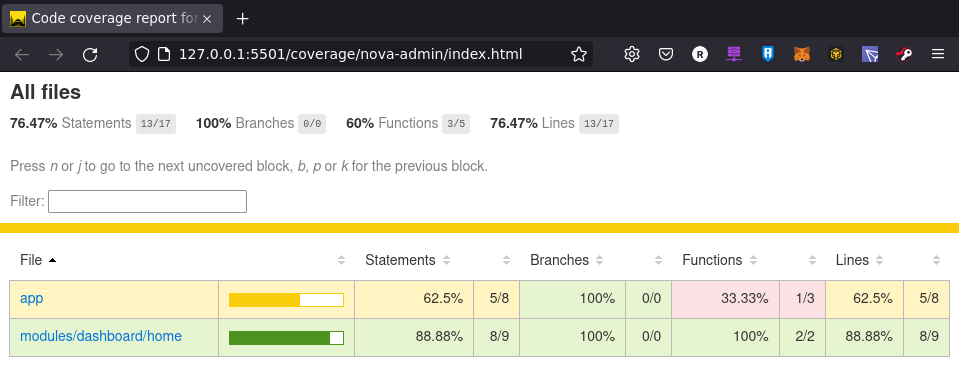

# 问题一：测试报告代码覆盖率

- 代码覆盖率插件 karma-coverage
  - angular v15+ 已经集成该插件，无需独立安装
  - https://angular.io/guide/testing-code-coverage

## Angular覆盖率报告
- Angular以集成coverage插件，产出代码覆盖率报告

``` sh
# 输出单元测试覆盖率报告至目录：/coverage/<project_name>/index.html
ng test --no-watch --code-coverage

# angular.json 配置项可设置每次test都生成覆盖率报告
"test": {
  "options": {
    "codeCoverage": true
  }
}
```

## 产出报告的格式

- 单元测试覆盖率，总览清单



- 单元测试覆盖率，文件详情


## 其他环境插件配置方法
- 详情参考 https://github.com/karma-runner/karma-coverage

``` ts
// # 安装插件
npm install karma-coverage --save-dev

// # 基础配置
// karma.conf.js
module.exports = function(config) {
  config.set({
    files: [
      'src/**/*.js',
      'test/**/*.js'
    ],

    // coverage reporter generates the coverage
    reporters: ['progress', 'coverage'],

    preprocessors: {
      // source files, that you wanna generate coverage for
      // do not include tests or libraries
      // (these files will be instrumented by Istanbul)
      'src/**/*.js': ['coverage']
    },

    // optionally, configure the reporter
    coverageReporter: {
      type : 'html',
      dir : 'coverage/'
    }
  });
};
```

# 问题二：前端自动化部署Web流程

## dist打包资源发布

``` sh
rsync -avPW -e "ssh -p 22" ~/workspace/training/nova-angular/dist/nova-angular/ root@xxx.xxx.com:/var/www/nova-angular/
```

## Nginx配置
``` yaml
server {

    server_name xxx.com;
    listen 80;


    # 启动Gzip Json模式 ######################################################
    gzip_http_version 1.0;  # gzip支持http协议 proxy 必须用
    gzip  on;
    gzip_vary on;
    gzip_proxied       any;
    gzip_static on;
    gzip_comp_level  4;
    gzip_min_length 256;
    gzip_buffers     4 8k;
    gzip_types       text/html text/plain application/javascript application/x-javascript text/css application/xml application/json;

    server_tokens off;

    large_client_header_buffers 4 32k;

    client_max_body_size 50M;
    charset utf-8;

    index index.html;

    root /var/www/nova-angular/;

    location / {
        try_files $uri $uri/ /index.html?$query_string;
    }
}
```

# 问题三：如何创造一个类似Angular的框架：以组件装饰器为例
- 相关内容：关于从TypeScript和基础Web，实现组件装饰器的过程

## 1.认识组件装饰器的实现过程
装饰器是一种特殊类型的声明，它能够被附加到类声明，方法， 访问符，属性或参数上。 装饰器使用 @expression这种形式，expression求值后必须为一个函数，它会在运行时被调用，被装饰的声明信息做为参数传入。

例如Angular中的 @Input：
``` ts
@Input() value: string;
// 这样看是不是清晰了点，实际上装饰器的作用是对设计模式中的装饰者模式的实现。
```

装饰者模式：

指在不必 改变原类文件 或者 使用继承 的情况下，动态扩展对象的功能

## 2.装饰器的类型

- 类装饰器： (target) =\> {}

- 方法装饰器：(target, methodName: string, descriptor: PropertyDescriptor) =\> {}

- 参数装饰器：(target, methodName: string, paramIndex: number) =\> {}

- 属性装饰器：(target, propertyName: string) =\> {}

## 组件的装饰器实现方法

- 示例 /docs/case-tslang/decorators.ts

``` ts
/* 装饰器
    * 参考文档:
        * 类装饰器:https://www.tslang.cn/docs/handbook/decorators.html#class-decorators
        * 元数据:Angular中元数据,采用工厂函数实现
    * 编译指令:
        * tsc ./decorators.ts --target ES5 --experimentalDecorators
        * 由于Angular使用了TS试验特性装饰器，需要增加参数 --experimentalDecorators
*/

/**
 * 组件装饰器,通过工厂函数实现可携带元数据的Component装饰器
 */
function Component(metaData?:{
    selector:string
    template:string
    styleCss:string
}){
    // 通过工厂函数,实现装饰器加载是,元数据参数传递
    return function(constructor:Function){
        constructor.prototype.selector = metaData?.selector
        constructor.prototype.template = metaData?.template
        constructor.prototype.styleCss = metaData?.styleCss
        constructor.prototype.ngOnInit = ()=>{}
        constructor.prototype.renderComponent = ()=>{
            // 渲染函数实现了组件的生命周期
            // constructor 构造函数在new Class时候已经执行了
            // 渲染过程:解析html,解析scss,解析变量函数方法
                let innerStyle = "<style>"+constructor.prototype.styleCss+"</style>";
                let innerHTML = constructor.prototype.template;
                if(document.getElementsByTagName(constructor.prototype.selector).length>0){
                    document.getElementsByTagName(constructor.prototype.selector)[0].innerHTML = innerStyle+innerHTML
                }
            // 完成渲染:调用ngOnInit()生命周期
            constructor.prototype.ngOnInit()
        }

    }
}

/**
 * 组件类定义参数,通过Component装饰器,快速定义组件页面\组件标签
 */
@Component({
    selector:"video-home",
    template:`
    <ul>
        <li>视频1:xxx.mp4</li>
        <li>视频2:xxx.mp4</li>
        <li>视频3:xxx.mp4</li>
    </ul>
    `,
    styleCss:`
        li{
            color:red
        }
    `
})
class VideoHomePage{
    constructor(){
    }
}

@Component({
    selector:"nova-like-button",
    template:`<button>点赞喜欢</button>`,
    styleCss:`button{
        border:solid 2px;
        border-color:yellow;
    }`
})
class LikeButtonComponent{
    constructor(){

    }
}


/**
 * 模块声明参数,写入在本模块可加载的组件类
 */
let ModuleDeclarations:any[] = [
    VideoHomePage,
    LikeButtonComponent
]

window.onload = ()=>{
    ModuleDeclarations.forEach((CompClass:any)=>{
        // 最终,由模块决定declaration中的组件,在对应的时间渲染
        let comp = new CompClass()
        comp.renderComponent() // 渲染组件
    })
}

```


# 问题四：前端自定义地形、3D展示等依赖库
## 渲染引擎：Babylon.js
- 参考文档：
    - 官方网站：https://www.babylonjs.com/
    - 起步文档：https://doc.babylonjs.com/
- 案例展示：
    - 地形：https://time-loop.fr/Arques/EXPERIENCES/3DSCAN/#!/
    - 港口：https://www.ibm.com/resources/cloud/mayflower-ship-experience/#/experience/harbor
    - 更多：https://playground.babylonjs.com/#P1RZV0

# 问题五：Web Worker 浏览器最小化时监听事件

## 可行性
- 需求场景：每15秒，刷新Token的解决方案
- 技术原理：Web Worker 生命周期
    - Web Worker 会创建 操作系统级别的线程。

> The Worker interface spawns real OS-level threads. -- MDN

## 具体实现
- 监听线程
    - 创建WebWorker线程，运行定时器，每15秒刷新Token
    - 刷新Token后，存储在localStorage.setItem("token","xxx)
- 数据调用
    - 通过onmessage实时监听event.data数据变化
    - 通过localStorage.getItem("token")全局获取实时数值
``` js
// window.onload 在主页加载后调用创建worker.js
var worker = new Worker("worker.js");
worker.onmessage = function(event){
    let workerToken = event.data;
    // 调用workerToken执行一些功能逻辑
};

// worker.js
var WORKER_TOKEN = ""; // 全局定义TOKEN变量
setInterval(function(){
    // 此处调用刷新Token的接口，并向worker监听者发送通知
    WORKER_TOKEN = ""
    localStorage.setItem("WORKER_TOKEN",WORKER_TOKEN)
    postMessage(WORKER_TOKEN);
},1000);
```
