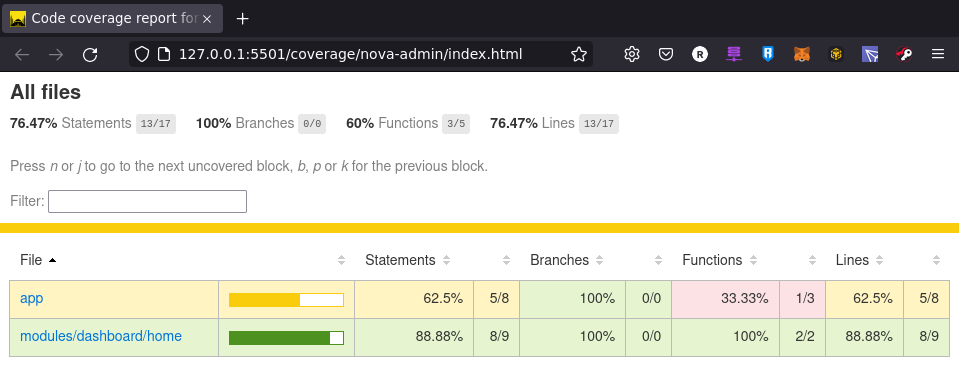
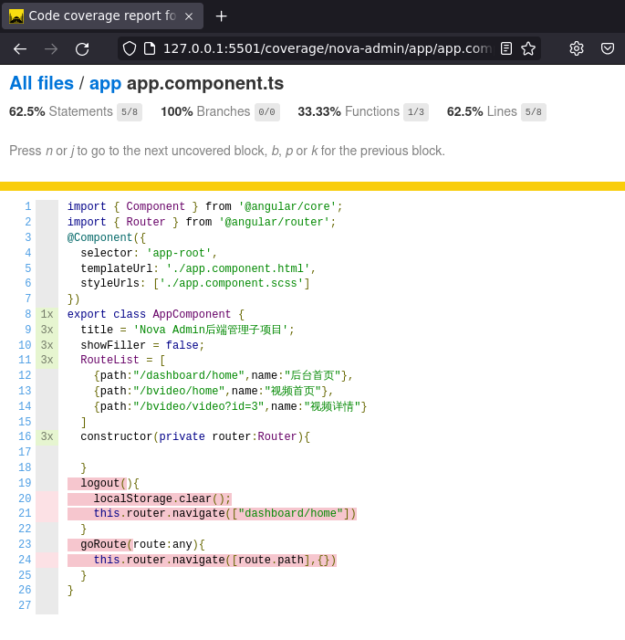

# 单元测试：检测最小可测试单元

单元测试，是指对系统中的最小可测试单元进行检查和验证。

每个类、组件、服务等开发，可以在xxx.component.spec.ts文件中，编写单元测试用例

单元测试示例：
- src\app\app.component.spec.ts
- src\modules\bvideo\home\home.component.spec.ts

编写规则详解：
- 编译阶段：通过组件是否正常编译，判断是否成功
- 属性加载：通过判断组件内属性及方法的预测值，判断是否成功
- 页面渲染：通过页面中可能存在的HTML元素及内部值，判断是否成功

# 测试报告：代码覆盖率
- 代码覆盖率插件 karma-coverage
  - angular v15+ 已经集成该插件，无需独立安装
  - https://angular.io/guide/testing-code-coverage

## Angular覆盖率报告
- Angular以集成coverage插件，产出代码覆盖率报告

``` sh
# 输出单元测试覆盖率报告至目录：/coverage/<project_name>/index.html
ng test --no-watch --code-coverage

# angular.json 配置项可设置每次test都生成覆盖率报告
"test": {
  "options": {
    "codeCoverage": true
  }
}
```

## 产出报告的格式

- 单元测试覆盖率，总览清单



- 单元测试覆盖率，文件详情



## 其他环境插件配置方法
- 详情参考 https://github.com/karma-runner/karma-coverage
``` ts
// # 安装插件
npm install karma-coverage --save-dev

// # 基础配置
// karma.conf.js
module.exports = function(config) {
  config.set({
    files: [
      'src/**/*.js',
      'test/**/*.js'
    ],

    // coverage reporter generates the coverage
    reporters: ['progress', 'coverage'],

    preprocessors: {
      // source files, that you wanna generate coverage for
      // do not include tests or libraries
      // (these files will be instrumented by Istanbul)
      'src/**/*.js': ['coverage']
    },

    // optionally, configure the reporter
    coverageReporter: {
      type : 'html',
      dir : 'coverage/'
    }
  });
};
```

# FAQ:CHROME_BIN环境变量未设置
解决方案：
```
#!/bin/sh
export CHROME_BIN="chromium"
```

问题描述：
``` sh
To disable this warning use "ng config -g cli.warnings.versionMismatch false".
✔ Browser application bundle generation complete.
11 12 2022 14:25:02.107:WARN [karma]: No captured browser, open http://localhost:9876/
11 12 2022 14:25:02.123:INFO [karma-server]: Karma v6.4.1 server started at http://localhost:9876/
11 12 2022 14:25:02.123:INFO [launcher]: Launching browsers Chrome with concurrency unlimited
11 12 2022 14:25:02.126:INFO [launcher]: Starting browser Chrome
11 12 2022 14:25:02.128:ERROR [launcher]: No binary for Chrome browser on your platform.
  Please, set "CHROME_BIN" env variable.
```