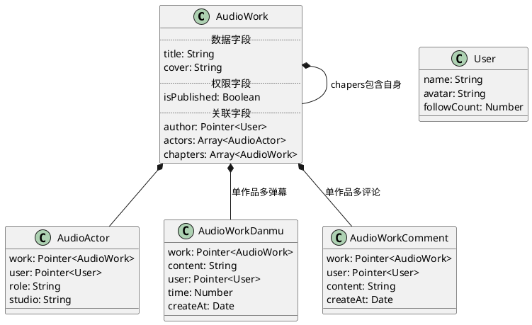
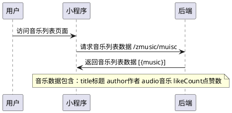
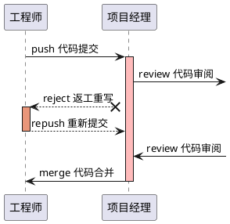

# UML技术文档编写规范

# 依赖插件
- VSCode插件：PlantUML
    - 参考文档：https://plantuml.com/
    - 快捷键：Alt+D
- 设置预览服务器
    - 配置文件/.vscode/settings.json
    - MD预览时，设置允许跨域资源访问
``` json
{
    "plantuml.server":"http://www.plantuml.com/plantuml"
}
```

- 预览示例，VSCode可在Ctrl+Shift+V中直接预览

# 类图：描述数据范式、接口、对象
- 参考文档：https://plantuml.com/class-diagram
- 相关资料：
    - [UML类图的对应关系](https://zhuanlan.zhihu.com/p/110209045)
    - [五分钟看懂UML类图](https://zhuanlan.zhihu.com/p/85960253)

## 示例：音频FM类图



# 时序图：描述业务流程及相关参与者

## 示例1：用户访问音乐页面时序图


## 示例2：项目代码提交审阅时序图


# FAQ:MD文档中plantuml代码端无法显示图片的自查流程

1. 检查插件PlantUML是否安装成功
2. 检查.vscode/settings.json里面的配置内容
3. 检查.md文件里面代码端格式：

\`\`\`plantuml

\`\`\`